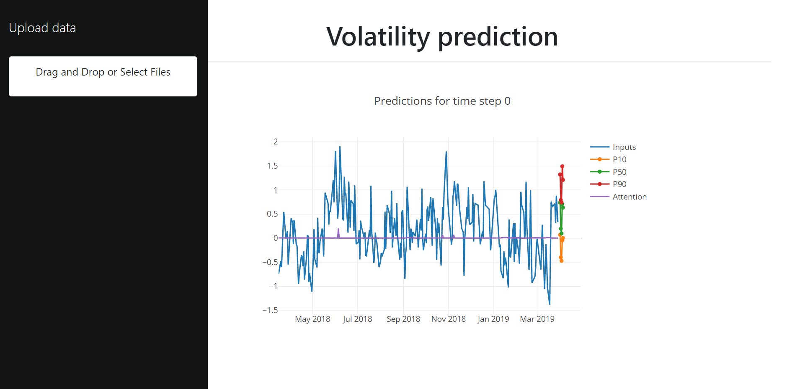
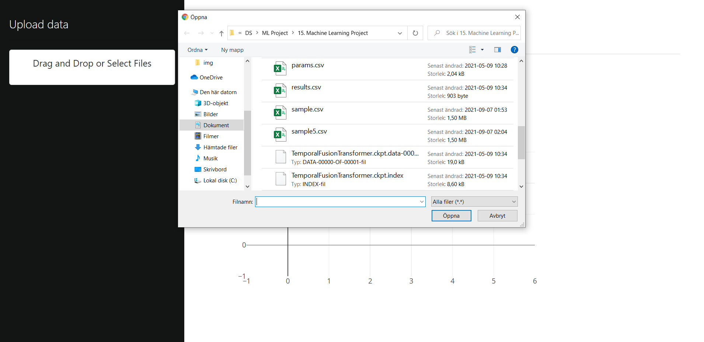

<!--
*** Thanks for checking out the Best-README-Template. If you have a suggestion
*** that would make this better, please fork the repo and create a pull request
*** or simply open an issue with the tag "enhancement".
*** Thanks again! Now go create something AMAZING! :D
***
***
***
*** To avoid retyping too much info. Do a search and replace for the following:
*** github_username, repo_name, twitter_handle, email, project_title, project_description
-->


<!-- PROJECT LOGO -->
<br />
<p align="center">
  <a href="https://github.com/kallebylin/repo_name">
    
  </a>

  <h3 align="center">Higher School of Economics Large Scale ML Final Project</h3>

  <p align="center">
    This project implements the Temporal Fusion Transformer architecture for interpretable multi-horizon forecasting (Lim et al., 2020). It is a modern attention-based architecture designed for dealing with high-dimensional time series with multiple inputs, missing values and irregular timestamps.
    <br />
    <a href="https://arxiv.org/pdf/1912.09363.pdf"><strong>See original paper »</strong></a>
    <br />
    <br />
    <a href="https://github.com/KalleBylin/tft_webapp/issues">Report Bug</a>
    ·
    <a href="https://github.com/KalleBylin/tft_webapp/issues">Request Feature</a>
  </p>
</p>


<!-- TABLE OF CONTENTS -->
<details open="open">
  <summary><h2 style="display: inline-block">Table of Contents</h2></summary>
  <ol>
    <li>
      <a href="#about-the-project">About The Project</a>
      <ul>
        <li><a href="#built-with">Built With</a></li>
      </ul>
    </li>
    <li>
      <a href="#getting-started">Getting Started</a>
      <ul>
        <li><a href="#installation">Installation</a></li>
      </ul>
    </li>
    <li><a href="#usage">Usage</a></li>
    <li><a href="#contact">Contact</a></li>
    <li><a href="#acknowledgements">Acknowledgements</a></li>
  </ol>
</details>


<!-- ABOUT THE PROJECT -->
## About The Project



Machine learning is today widely used around the world and has opened up new possibilities to extract deep insights from data and allow machines to make high quality predictions. Still, one of the largest challenges today in ML has to do with the deployment of these algorithms with large scale data. 

Large scale Machine Learning aims to solve these challenges through tools and methods like model optimization, computation parallelism, and scalable deployment.

This project is an example on how a deep learning model can be deployed to a webapp with asynchronous request processing. 


### Built With

* [FastAPI](https://fastapi.tiangolo.com/)
* [Pytorch](https://pytorch.org/)
* [Celery](https://docs.celeryproject.org/en/stable/index.html)
* [Redis](https://redis.io/)
* [Docker](https://www.docker.com/)
* [Dash](https://plotly.com/dash/open-source/)


<!-- GETTING STARTED -->
## Getting Started

To get a local copy up and running follow these simple steps.


### Installation

1. Clone the repo
   ```sh
   git clone https://github.com/KalleBylin/tft_webapp.git
   ```

This will clone the latest version of the TFT Webapp repository to your machine.

2. Install docker and docker-compose

Make sure you have installed Docker on your machines in order to run this project.


###### Run entire app with one command 
```
sudo docker-compose up --build
```

This will start multiple services:

* Sets up a Redis database whcih will be used as a message broker and keep track of the tasks' states.
* Initializes a Celery app which acts as our task queue so that they can run asynchronously.
* Starts a model web server with rest api built with FastAPI and listens for messages at localhost:8000. 
* Deploys a web app that can be opened in the browser and used to upload a batch of data and then receives predictions from the model web server.


#### Test over REST API

We can send a sample of data to the model through a POST request like this:

```python
r = requests.post("http://model_server:8000/predict", json=json_data)
```

Here json_data corresponds to the inputs of the model in JSON format. 

This POST request will return the task_id of the prediction task that is requested:

```
{
  "task_id": "353286k1-j125-6776-9889-f7b447nat1fcb"
}
```

The task will be handled by Celery. In the meantime we can send a GET request to understand the status of the task:

```python
r = requests.get("http://model_server:8000/predict/353286k1-j125-6776-9889-f7b447nat1fcb")
```

This will either give us an update stating that the task is in progress:

```
{
  "status": "IN_PROGRESS"
}
```

Or return a status of "DONE" with the output of the task:

```
{
  "status": "DONE",
  "result": {
    "outputs": [[...]]
  }
}
```

Here is an example from the browser:


<!-- USAGE EXAMPLES -->
## Usage

Once all of the containers are up and running, you can find the webapp in your browser by opening:

```
http://localhost:8083/
```

This is the empty view:


To the left there is a section to upload csv files. A sample file is included in this repo. To generate more data you can visit the repo with the training code and use the dataloaders to generate a new batch of data. 



After approximately 8-12 seconds the graph will visualize the data including the inputs, the three prediction scenarios and additionally the weights produced by the attention mechanism to better understand what constributed to the prediction.


In this particular case it is interesting to see the largest spike around June 2018 which corresponds to the highest peak of the stock within the current timeframe.

It is worth noting that Dash is interactive, so it is possible to quickly zoom into certain sections of the graph if necessary.


## Model training code, architecture and metrics

The model training code can be found [in this repo](https://github.com/KalleBylin/temporal-fusion-transformers)


### Temporal Fusion Transformer architecture

The TFT architecture is defined in the paper *Temporal Fusion Transformers for Interpretable Multi-horizon Time Series Forecasting* has the following structure:


Source: https://arxiv.org/pdf/1912.09363.pdf

#### Gated Linear Unit and Gated Residual Network

Gated Residual Network blocks are among the main basic components of this network. They enable efficient information flow along with the skip connections and gating layers.

The gating mechanisms basically allow the network to adapt both depth and complexity in order to perform well on a wide range of datasets and tasks.

**Gated Linear Unit**

It is hard to know which variables are actually relevant for the prediction task from the outset. The gates of the Gated Linear Unit make it possible to suppress parts of the architecture that are not necessary in a particular scneario or with a specific dataset.

**Gated Residual Network**

The Gated Residual Network is a flexible block that can apply non-linear processing when required. The Gated Linear Unit defined above helps the GRN how much to contribute to its input and could potentially skip the layer altogether if necessary. GLU outputs close to 0 would suppress the non-linear contribution.

#### Variable Selection Network

The Variable Selection Network is a critical component of the TFT architecture as it makes it possible for the model to accept a wide variety of inputs.

- Observed inputs are time dependent variables that are known only up until the moment when we want to forecast the target variable (this includes past values of the target variable).


- Known inputs are time dependent variables that can be known ahead of time (e.g. holidays, special events, etc.)


- Static covariates can also be used to enrich the model (e.g. region of a store).


With so many variables we might end up with unnecessary noise that can have a negative impact on the performance of the model and the Variable Selection Network makes it possible for the model to eliminate this noise.

It can also be used during prediction to evaluate which variables are most important for the prediction task. This is critical for interpretability of the trained model.

#### Interpretable Multi-Head Attention

This particular block is used to learn long-term relationships from observed time-varying inputs. It is a modified version of the more general multi-head attention block used in transformer-based architectures, in order to improve explainability.

Scaled Dot-Product Attention and Multi-Head Attention were both presented in the paper "Attention Is All You Need" by Vaswani et al.

It is well-known that the dot-product is a very simple but powerful tool to evaluate similarity between two vectors. For this same reason, it is also a great tool to help our model know what parts of the inputs to focus on based on the keys and queries. The scaling factor helps improve the performance of dot product attention by not allowing the softmax to move into regions with very small gradients.

Multi-head attention allows us to compute multiple attention computations in parallel on different projections of the keys, queries and values. This makes it possible for the model to leverage different types of information in the input which would otherwise be lost by the averaging effect in a single attention head.

The original version fails in allowing us to be able to interpret the importance of each feature. \emph{The TFT proposes a modification of multi-head attention such that there are shared value weights among the different heads with an additive aggregation of the heads for better interpretability}.


### Metrics and results

#### Quantile Loss

As described in the original paper, a prediction interval makes it possible to better understand the uncertainty around a particular point estimation and makes it possible to optimize decisions and manage risk by understanding potential best and worst-case scenarios.

For this reason quantile loss is used to train the model. In this case P10, P50 and P90 were used. An example of the output can be seen here:


As well as the training loss during training:


Here we can see one example where the model shows higher levels of attention specifically in large drops of the stock as well as some additional focus on the last days before the prediction. This is quite logical due to the high volatility of stocks.


Another interesting view can be seen with the heatmap. It is common in NLP tasks when using attention to analyze which words had a larger weight when generating a specific predicton (e.g. which words in English were more influential in generating a word in French in a translation task).


These visualizations allow us to better understand what influenced the model in its prediction. This can be a source of new insights as well as a protection against decisions made based on erroneous predictions. A domain expert can analyze these relationships in time to better understand if the weight actually makes sense or not.


<!-- LICENSE -->
## License

 Copyright 2021 The Google Research Authors.

Licensed under the Apache License, Version 2.0 (the "License");
you may not use this file except in compliance with the License.
You may obtain a copy of the License at

    http://www.apache.org/licenses/LICENSE-2.0

Unless required by applicable law or agreed to in writing, software
distributed under the License is distributed on an "AS IS" BASIS,
WITHOUT WARRANTIES OR CONDITIONS OF ANY KIND, either express or implied.
See the License for the specific language governing permissions and
limitations under the License.


<!-- CONTACT -->
## Contact

Kalle Bylin - kbylin@edu.hse.ru

Project Link: [https://github.com/KalleBylin/tft_webapp](https://github.com/KalleBylin/tft_webapp)


<!-- ACKNOWLEDGEMENTS -->
## Acknowledgements

Special acknowledgements to the authors of the original paper:

* Bryan Lim
* Sercan Arik
* Nicolas Loeff
* Tomas Pfister


